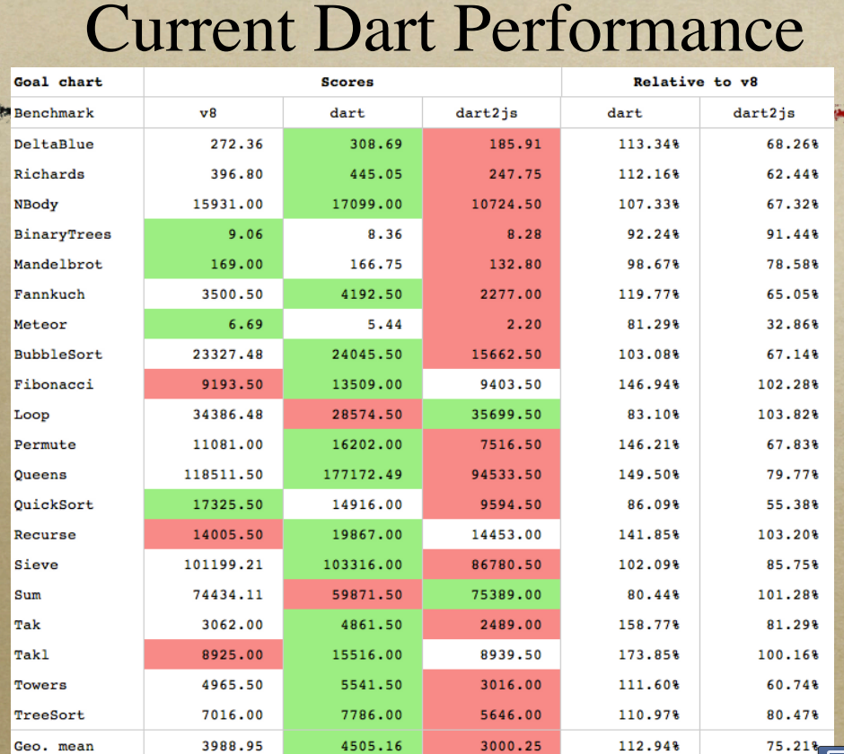

Dart VM Advent Calendar 2012 12/01
###############################################################################

これが最新のVMだ！

断じてV8からjavascript向け最適化を取り除いたVMではない。

.. image:: png/dart.png

Dart VMの魅力
==============================================================================

Dart VMの最大の魅力は、速さへのこだわりです。

既にV8より10倍高速に起動し、将来的には2倍高速に動作するのを目指しているようです。

ここ十年のVMとJITコンパイラ系の技術の進化は素晴らしくて、
JavaScriptにどのくらい性能向上できる余地が残っているのか、
何がボトルネックなのかが見えているのだと思います。

そして、その壁をECMAScriptの仕様改善により進化させていくことも可能だと思います。

私には、さらなる性能向上を目指したVMのDesignと、
性能向上を優先した上で柔軟な言語仕様を提供しようとしている
Dart VMとDartが非常に魅力的に映ります。

Dart VMの性能
==============================================================================
いくつかV8より高速に動作するベンチマークもぼちぼち出てきたようです。

score表示であり、緑色が優れています。

DeltaBlueやRichardsは、octane-benchmarkにも含まれているもので、
以下のdart benchmark harnessから試すことができます。

https://github.com/dart-lang/benchmark_harness

Dart VMは、上記にあげたいくつかのベンチマークで、V8よりも高速に動作するようです。

とはいえ、上記にあげた大部分はマクロベンチマークで、部分的な比較でしかないよう思います。

中規模のベンチマークであるoctaneに関しても、上記にあげた2つ以外は、V8のほうが速いと予想します。

現在のV8とDart VMを比較すると、文字列や乱数を使用するベンチマークは、V8のほうが高速なはずです。

Dart VMが高速に動作するケースは、Array(主にscalarlist)を使用するものや、
premitive型に落ちやすい要素が多いベンチマークなのかな？と思っています。

VMの匠
==============================================================================

VMの匠、Lars Bak氏 26年ってすごいと思います。

氏と、最先端のVMチームの経験に学ばせていただこうかなと。。

この資料が詳しいです。

http://www.dartlang.org/slides/2012/09/strangeloop/pushing-the-limits-of-web-browsers-lars-bak.pdf

Dartの言語仕様
==============================================================================

dartの言語仕様をsmalltalkと比較した紹介資料です。 これがわかりやすい。

http://www.dartlang.org/slides/2012/03/smalltalk-industry-conference/DARTtalk-20120319.pdf

気になるところは、

(1) not support eval.
  性能を優先した妥協点なのだと思います。

(2) Classes is not first class objects.
  関数はfirst class objectです。

  そのため、isolateのmessage passingも関数単位で記述します。

  Classesをmessage passingできたら便利かもなーと、
  isolateを書いていて思うことはありますね。

(3) mirror based reflection. Fields can’t be added dynamically.
  動的に追加できたらjavascript似たりよったりで同じ問題が起こるように思います。

  性能を優先した妥協点なのだと思います。

個人的には、
List内包表記、pattern matching、eval、yield、型推論のような機能が欲しいですよね。。

大体はdartが発表された2011/11にdart discussionに突撃して、
そんな機能はないよ -> dart言語設計センスない、、
と言われるところにつながっているのかも。
