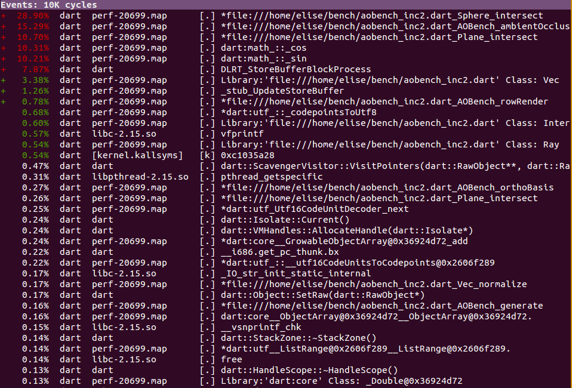
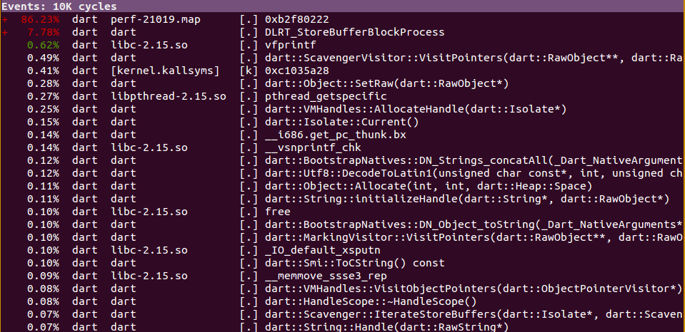

Dart VM Advent Calendar 2012 12/09
###############################################################################

Linux Perf Profiling
===============================================================================

dartはperfと連携し、実行時の情報を含めてprofilingすることができます。

以下のURLでも紹介されています。

http://code.google.com/p/dart/wiki/Profiling

試し方 ::

  $ perf record -f -g dart --generate_perf_events_symbols aobench.dart
  $ perf report --call-graph flat

JITコンパイルしたコードのプロファイル情報を取得できており、ボトルネックの調査がしやすくなっています。

perfで測定時は、dartに--generate_perf_events_symbolsオプションを指定しない場合、
Dart VMは単体のプロセスとしてperfの解析対象となります。

以下のような味気ないプロファイル結果になってしまいますのでご注意ください。

試し方 ::

  $ perf record -f -g dart aobench.dart
  $ perf report --call-graph flat

これはこれで、ScavengerやMarkingというログがみえていますが、これらはGCです。

ubuntu12だか、いつかのkernel更新から、perf reportがstdoutにtext形式で結果を出力するのではなく、
専用のviewerを開くようになりました。

カーソルで上下移動し、右を押すと対象シンボルのアセンブラ表示に切り替え、
アセンブラ命令のfrequencyをみれるようになってます。

Dart VMの場合、perf reportする際にはJITコンパイルしたコードが捨てられているので、あまり意味はないです。

perf連携用ファイルの生成
===============================================================================
Dart VMは、--generate_perf_events_symbolsオプションを指定した場合、
JITコンパイルしたコードの情報(アドレス、サイズ、シンボル)を記録したファイルを生成しています。

perfは、record時にDart VMが生成したファイル(/temp/perf-[dart pid].map)を参照します。

Dart VMは、Process::CurrentProcessId()でdart自体のプロセスIDを取得したのち、
"/tmp/perf-%ld.map", pid というファイルを生成し、以下のようなアドレス、サイズ、シンボル情報を書き込みます。

pidの参照 ::

  $ ps -la
  F S   UID   PID  PPID  C PRI  NI ADDR SZ WCHAN  TTY          TIME CMD
  0 S  1000  6987  5680  0  80   0 -  1533 wait   pts/4    00:00:00 perf.sh
  0 S  1000  6988  6987  0  80   0 -  1388 poll_s pts/4    00:00:00 perf_3.2.0-30
  0 R  1000  6991  6988 96  80   0 - 19996 -      pts/4    00:00:05 dart
  0 R  1000  6994  5681  0  80   0 -  1410 -      pts/6    00:00:00 ps

/tmp/perf-6991.mapの中身 ::

  // addr  size marker symbol
  b3006ef8 10e dart:core__StringBufferImpl@0x36924d72__StringBufferImpl@0x36924d72.
  b3007018 a4 dart:core__StringBufferImpl@0x36924d72_clear
  b30070d8 30 dart:core__StringBufferImpl@0x36924d72_set__buffer@0x36924d72
  b3007118 30 dart:core__StringBufferImpl@0x36924d72_set__length@0x36924d72
  b301a228 e file:///home/elise/bench/aobench_inc2.dart_Intersection_get_t
  b301a248 30 file:///home/elise/bench/aobench_inc2.dart_Intersection_set_p
  b301a288 b23 file:///home/elise/bench/aobench_inc2.dart_AOBench_ambientOcclusion   <-- JITコンパイル(非最適化)
  b301adc8 e file:///home/elise/bench/aobench_inc2.dart_AOBench_get_NAO_SAMPLES
  b301ade8 e file:///home/elise/bench/aobench_inc2.dart_Intersection_get_p
  b301ae08 e file:///home/elise/bench/aobench_inc2.dart_Intersection_get_n
  b301ae28 49b file:///home/elise/bench/aobench_inc2.dart_AOBench_orthoBasis         <-- JITコンパイル(非最適化)
  b301b638 bd dart:math_::_cos
  b301b708 bd dart:math_::_sin
  b301b7d8 101b *file:///home/elise/bench/aobench_inc2.dart_AOBench_ambientOcclusion <-- JITコンパイル(最適化)
  b301c808 39b *file:///home/elise/bench/aobench_inc2.dart_Vec_cross
  b301cbb8 32c *file:///home/elise/bench/aobench_inc2.dart_Vec_-
  b301cef8 d6a *file:///home/elise/bench/aobench_inc2.dart_Sphere_intersect
  b301dc78 bf1 *file:///home/elise/bench/aobench_inc2.dart_AOBench_orthoBasis        <-- JITコンパイル(最適化)

アドレスとシンボル情報は、基本的にコンパイル順にファイルに書き出していきます。

vm/code_observers.cc ::

  virtual void Notify(const char* name,
                      uword base,
                      uword prologue_offset,
                      uword size,
                      bool optimized) {
    const char* format = "%"Px" %"Px" %s%s\n";       // address, asm codesize, marker, symbol
    const char* marker = optimized ? "*" : "";       // optimized functionは、markerとして*をつける。
    intptr_t len = OS::SNPrint(NULL, 0, format, base, size, marker, name);
    char* buffer = Isolate::Current()->current_zone()->Alloc<char>(len + 1);
    OS::SNPrint(buffer, len + 1, format, base, size, marker, name);
    Dart_FileWriteCallback file_write = Isolate::file_write_callback();
    ASSERT(file_write != NULL);
    void* file = Dart::perf_events_file();
    ASSERT(file != NULL);
    (*file_write)(buffer, len, file);
  }

上記Notifyは、JITコンパイルの終了処理において、Code::FinalizeCode()から呼ばれます。

そのため、非最適化、最適化に限らず、
JITコンパイルされたコードのEntryAddress, Size, Symbolが逐一ファイルに出力されます。

そのため、記録の粒度はJITコンパイルされた関数単位です。

OnStackReplacement等、CodeのEntryが複数ある場合、ちょっと工夫しないといけないかもです。

MultiThread Profiling
===============================================================================

最近、intel VTUNE用インターフェースも追加されましたが、そちらはまだ試せていないです。

isolateを複数生成した重い処理を行った際に、VTUNEでどのように見えるのか試してみたいです。

.. note ::

  LLVMがVTUNEによるJIT Profiling対応してのも今年からだったかな。3.2から？

まとめ
===============================================================================
(1) perfを使えば、jITコンパイルしたコードのプロファイル情報を手軽に取得できる。
(2) perfと連携するため、アドレス、サイズ、シンボル情報をファイルに出力している。
