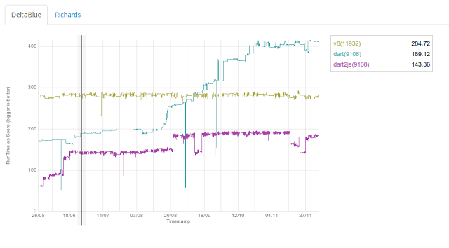

Dart VM Advent Calendar 2012 12/13
###############################################################################

Benchmark and Performance Tips
===============================================================================

Dart VMでは、Benchmark harnessというリポジトリで
js向けベンチマークのOctaneの一部をdartに移植したベンチマークを公開しており、手軽に試すことができます。

https://github.com/dart-lang/benchmark_harness.git

試す場合は、pubというdart-sdkに付属したスクリプトが必要になります。

下記で、sdk-binにパスを通します。::

 $ export PATH=xxx/dart-sdk/bin

pub installの前後
===============================================================================

pubコマンドを使用すると、手軽にdartのパッケージの環境を整えることができます。

あんまり試してないので、詳しいことは不明です。

以下のURLで解説しています。

http://pub.dartlang.org/doc/

前 ::

  $ cd benchmark_harness/
  $ ls
    README.md  example  lib  pubspec.yaml

後 ::

  $ pub install
    Resolving dependencies...
    Dependencies installed!

  $ ls
    README.md  example  lib  packages  pubspec.lock  pubspec.yaml

上記で、benchmark harnessのパッケージのインストールが完了し、ベンチマークを試すことができます。

dart Benchmark harness
===============================================================================

お試し。 ::

  $ cd benchmark_harness/example
  $ dart DeltaBlue.dart
    DeltaBlue(RunTime): 2728.512960436562 us.
  $ dart Template.dart
    Template(RunTime): 0.5470164764097777 us.
  $ dart Richards.dart
    Richards(RunTime): 2212.3893805309735 us.

最近のnewsによると、上記DeltaBlueとRichardsは、V8と比較して50%高速に動作するのだとか。

JavaScript BenchmarkのOctaneはスコアで結果が帰ってくるのに、上記benchmark_harnessのサンプルは実行時間？で結果を返すためよくわかりませんね。

Dartのプログラムで気をつけること。
===============================================================================

Dart VMの特徴の一つに、SmallTalk由来の概念だと思うのですが、
実行時の型に応じてメソッドが変わります。実行時のDynamic Typingです。

Javaであれば、多相性により呼び出し先が複数ありえるのは、interfaceを実装したクラスが複数あるときなど、
明示的にわかるかと思います。

しかしDart VMは、すべてのInstanceCall(+や-などのoperatorも含む、operator overloadといいながら、InstanceCallのOverride)
が多相性の性質を持つことにより、実行時のDynamic Typingを実現しています。

そのため、意図しない多相性には注意が必要です。

特にボトルネックとなる処理への混入には注意が必要でしょう。

例をあげます fibo3.dart ::

  fibo(var n) {
    if (n < 2) {
      return n;
    } else {
      return fibo(n - 1) + fibo(n - 2);
    }
  }

  main() {
    fibo(2);
    fibo(2.0);
    print("ret = ${gettime(() => print(fibo(40)))} ms");
  }

概要でも示したfiboのコードの型をintからvarに変えました。

そのため、fiboの引数にdouble型を与えても実行できます。 また、DartEditorでwarningはでません。

結果は以下です。 ::

  $ dart fibo.dart
  102334155
  ret = 945 ms
  $ dart fibo3.dart
  102334155
  ret = 3053 ms       <-- int型の3倍

なぜ遅くなっているかというと、fibo(2.0)のところが原因です。

2.0を引数に与えてしまったため、fibo関数は、int型とdouble型を実行時の型情報として収集します。

そのため、JITコンパイル(最適化)の際には、int型とdouble型の両方で動作するようにコンパイルします。

javaでいうと、interfaceを実装した複数のクラスのメソッドを呼び分けるようなものだと思います。

PolymorphicInstanceCall
===============================================================================

基本はperf等でボトルネックがどうなっているのか確認することですが、プロファイル以外の方法を紹介します。

中間表現を比較してみます。 ::

  // fibo3.dart
  0: B0[graph] {
        v0 <- Constant:29(#null)
        v1 <- Parameter:30(0) {PT: dynamic} {PCid: dynamic}
  }
    2: B1[target]
    4:     CheckStackOverflow:2()
    6:     v2 <- Constant:4(#2) {PT: _Smi@0x36924d72} {PCid: _Smi@0x36924d72} [2, 2]
    7:     ParallelMove eax <- S-1, ecx <- edx, S+0 <- edx
    8:     Branch if RelationalOp:5(<, v1, v2 IC[2: _Smi@0x36924d72, _Smi@0x36924d72 #587 | _Double@0x36924d72, _Smi@0x36924d72 #3]) goto (2, 3) env={ v1 [S-1], v1 [S-1], v2 [C] }
   10: B2[target]
   11:     ParallelMove eax <- S-1
   12:     Return:8(v1)
   14: B3[target] ParallelMove ecx <- S-1, eax <- S+0
   16:     PushArgument:10(v1) {PCid: dynamic}
   18:     v3 <- Constant:11(#1) {PT: _Smi@0x36924d72} {PCid: _Smi@0x36924d72} [1, 1]
   20:     PushArgument:12(v3) {PCid: dynamic}
   22:     v4 <- PolymorphicInstanceCall:31(-, v1, v3 IC[2: _Smi@0x36924d72, _Smi@0x36924d72 #309 | _Double@0x36924d72, _Smi@0x36924d72 #1]) {PT: dynamic} {PCid: dynamic} env={ v1 [S-1], a0, a1 }
   23:     ParallelMove eax <- eax
   24:     PushArgument:14(v4) {PCid: dynamic}
   26:     v5 <- StaticCall:15(fibo v4) {PT: dynamic} {PCid: dynamic} env={ v1 [S-1], a0 }
   27:     ParallelMove eax <- eax
   28:     PushArgument:16(v5) {PCid: dynamic}
   29:     ParallelMove eax <- S-1
   30:     PushArgument:18(v1) {PCid: dynamic}
   31:     ParallelMove ecx <- S+0
   32:     PushArgument:20(v2) {PCid: dynamic}
   34:     v7 <- PolymorphicInstanceCall:32(-, v1, v2 IC[2: _Smi@0x36924d72, _Smi@0x36924d72 #276 | _Double@0x36924d72, _Smi@0x36924d72 #1]) {PT: dynamic} {PCid: dynamic} env={ v1 [S-1], a0, a1, a2 }
   35:     ParallelMove eax <- eax
   36:     PushArgument:22(v7) {PCid: dynamic}
   38:     v8 <- StaticCall:23(fibo v7) {PT: dynamic} {PCid: dynamic} env={ v1 [S-1], a0, a1 }
   39:     ParallelMove eax <- eax
   40:     PushArgument:24(v8) {PCid: dynamic}
   42:     v9 <- PolymorphicInstanceCall:33(+, v5, v8 IC[2: _Smi@0x36924d72, _Smi@0x36924d72 #273 | _Double@0x36924d72, _Double@0x36924d72 #1]) {PT: dynamic} {PCid: dynamic} env={ v1 [S-1], a0, a1 }
   43:     ParallelMove eax <- eax
   44:     Return:26(v9)

お馴染みのfibo(int)の中間表現です。 ::

  // fibo.dart
  0: B0[graph] {
        v0 <- Constant:29(#null)
        v1 <- Parameter:30(0) {PT: dynamic} {PCid: dynamic}
  }
    2: B1[target] ParallelMove eax <- S-1
    4:     CheckStackOverflow:2()
    6:     v2 <- Constant:4(#2) {PT: _Smi@0x36924d72} {PCid: _Smi@0x36924d72} [2, 2]
    8:     CheckSmi:5(v1) env={ v1 [eax], v1 [eax], v2 [C] }
   10:     Branch if RelationalOp:5(<, v1, v2 IC[1: _Smi@0x36924d72, _Smi@0x36924d72 #588]) goto (2, 3)
   12: B2[target]
   13:     ParallelMove eax <- eax
   14:     Return:8(v1)
   16: B3[target]
   18:     v3 <- Constant:11(#1) {PT: _Smi@0x36924d72} {PCid: _Smi@0x36924d72} [1, 1]
   20:     ParallelMove ecx <- eax
   20:     v4 <- BinarySmiOp:13(-, v1, v3) {PT: _Smi@0x36924d72} {PCid: _Smi@0x36924d72} [1, 1073741822] -o
   22:     PushArgument:14(v4) {PCid: dynamic}
   24:     v5 <- StaticCall:15(fibo v4) {PT: dynamic} {PCid: dynamic} env={ v1 [S-1], a0 }
   25:     ParallelMove eax <- eax
   26:     ParallelMove ecx <- S-1, S+0 <- eax
   26:     v7 <- BinarySmiOp:21(-, v1, v2) {PT: _Smi@0x36924d72} {PCid: _Smi@0x36924d72} [0, 1073741821] -o
   28:     PushArgument:22(v7) {PCid: dynamic}
   30:     v8 <- StaticCall:23(fibo v7) {PT: dynamic} {PCid: dynamic} env={ v1 [S-1], v5 [S+0], a0 }
   31:     ParallelMove ecx <- eax, eax <- S+0
   32:     CheckSmi:25(v5) env={ v1 [S-1], v5 [eax], v8 [ecx] }
   34:     CheckSmi:25(v8) env={ v1 [S-1], v5 [eax], v8 [ecx] }
   36:     ParallelMove edx <- eax
   36:     v9 <- BinarySmiOp:25(+, v5, v8) {PT: _Smi@0x36924d72} {PCid: _Smi@0x36924d72} [-inf, +inf] +o env={ v1 [S-1], v5 [eax], v8 [ecx] }
   37:     ParallelMove eax <- edx
   38:     Return:26(v9)

ざっくり、最後のfobo(n-1) + fibo(n-2)の部分を比較してみます。 ::

   // fibo3()
   39:     ParallelMove eax <- eax
   40:     PushArgument:24(v8) {PCid: dynamic}
   42:     v9 <- PolymorphicInstanceCall:33(+, v5, v8 IC[2: _Smi@0x36924d72, _Smi@0x36924d72 #273 | _Double@0x36924d72, _Double@0x36924d72 #1]) {PT: dynamic} {PCid: dynamic} env={ v1 [S-1], a0, a1 }
   43:     ParallelMove eax <- eax
   44:     Return:26(v9)

   // fibo()
   32:     CheckSmi:25(v5) env={ v1 [S-1], v5 [eax], v8 [ecx] }
   34:     CheckSmi:25(v8) env={ v1 [S-1], v5 [eax], v8 [ecx] }
   36:     ParallelMove edx <- eax
   36:     v9 <- BinarySmiOp:25(+, v5, v8) {PT: _Smi@0x36924d72} {PCid: _Smi@0x36924d72} [-inf, +inf] +o env={ v1 [S-1], v5 [eax], v8 [ecx] }
   37:     ParallelMove eax <- edx
   38:     Return:26(v9)

Smi型とdouble型を取りうる、fibo3のほうは、PolymorphicInstanceCall中間表現にあっており、

Smi型のみ取りうるfibi()は、BinarySmiOp中間表現になっています。

この差は大きいです。

fibo3() PolymorphicInstalceCall ::

  0xb2f88d59    50                     push eax       // 引数をpush
  0xb2f88d5a    8b442404               mov eax,[esp+0x4]
  0xb2f88d5e    bf28000000             mov edi,0x28   // Smi型をload
  0xb2f88d63    a801                   test al,0x1    // 引数がSmi型か？
  0xb2f88d65    7404                   jz 0xb2f88d6b
  0xb2f88d67    0fb77801               movzx_w edi,[eax+0x1]
  0xb2f88d6b    83ff28                 cmp edi,0x28   // Smi型かチェック
  0xb2f88d6e    0f8512000000           jnz 0xb2f88d86 // Smi型でなければ、double型チェックへ
  0xb2f88d74    ba19cc12b3             mov edx,0xb312cc19  Array[2, 2, null]
  0xb2f88d79    e84a763702             call 0xb53003c8  [stub: CallStaticFunction] //Smi型でcall
  0xb2f88d7e    83c408                 add esp,0x8
  0xb2f88d81    e916000000             jmp 0xb2f88d9c  // goto return
  0xb2f88d86    83ff2b                 cmp edi,0x2b    // double型 check
  0xb2f88d89    0f8536000000           jnz 0xb2f88dc5  // goto deopt , double型でない。
  0xb2f88d8f    ba19cc12b3             mov edx,0xb312cc19  Array[2, 2, null]
  0xb2f88d94    e82f763702             call 0xb53003c8  [stub: CallStaticFunction] //double型でcall
  0xb2f88d99    83c408                 add esp,0x8

  //return
  0xb2f88d9c 

PolymorhicInstalceCallのほうは、2つの呼び出し候補があるため、Smi型か判定し、Smi型であればSmi型のfiboをcall

double型か判定し、double型であればdouble型のfiboをcall

どちらでもない場合は、deoptimizationをcallします。

fibo() BinarySmiOp ::

  0xb3048ad2    89c1                   mov ecx,eax
  0xb3048ad4    8b45f8                 mov eax,[ebp-0x8]
  0xb3048ad7    a801                   test al,0x1         // Smi check
  0xb3048ad9    0f8533000000           jnz 0xb3048b12      // goto notSmi deopt
  0xb3048adf    f6c101                 test_b ecx,0x1      // Smi check
  0xb3048ae2    0f852f000000           jnz 0xb3048b17      // goto notSmi deopt
  0xb3048ae8    89c2                   mov edx,eax
  0xb3048aea    03d1                   add edx,ecx         // add
  0xb3048aec    0f802a000000           jo 0xb3048b1c       // goto overflow deopt

意図せずPolymorphicInstanceCallになった場合には、BinarySmi演算のおよそ3倍遅いと思ったほうがよいでしょう。

上記のようにならないためには、--print-flow-graphオプションを指定して、中間表現をダンプした後、

複数の型が候補になっているInstanceCallがないか確認すればOKです。

例 ) ::

   34:     v7 <- PolymorphicInstanceCall:32(-, v1, v2 IC[2: _Smi@0x36924d72, _Smi@0x36924d72 #276 | _Double@0x36924d72, _Smi@0x36924d72 #1]) {PT: dynamic} {PCid: dynamic} 
                                                      ^ ここ

中間表現をダンプして、適当に"IC[2"等でgrepすれば見つけられます。

aobenchの例
===============================================================================

dart版aobenchを例に、polymorphicIntanceCallを探してみます。

dart:core__StringBufferImpl@0x36924d72_add ::

  8:     v3 <- PolymorphicInstanceCall:52(toString, v2 IC[2: _Smi@0x36924d72 #99 | _OneByteString@0x36924d72 #150]) {PT: dynamic} {PCid: dynamic} 

StringBufferクラスのaddメソッド、特にtoSTringなどはしょうがないかなと思います。

toStringは例外ですね。

dart:core__HashMapImpl@0x36924d72__probeForLookup@0x36924d72 ::

 74:     Branch if EqualityCompare:61(v17 == v2 IC[2: _Smi@0x36924d72, _Smi@0x36924d72 #3 | _DeletedKeySentinel@0x36924d72, _Smi@0x36924d72 #1]) goto (6, 7)

ん？ HashMapのprobeForLookupでSmiの他にDeletedKeySentinelが引っかかってますね。。

coreライブラリですが、、どうなってるんでしょうね。。 null値みたいなもんですか？

特にEqualityCompareにはnull型が入ってくる可能性があります。

Dart VMのEqualityはnull型を特別扱いしており、型情報を収集して最適化JITコンパイルする際に隠蔽しています。

そのためEquality中間表現は、nullが来ることを想定してアセンブラをEmitしています。

もしボトルネック部分にPolymorphicInstanceCallが来る場合は、クラスのコンストラクタ等でデータ型をあらかじめ変換した上で、

ボトルネックに単一型のみ来るようにすれば回避できます。

Left Shift
===============================================================================
もう一つ、int型の左シフトに注意する必要があります。

CやJavaの言語仕様のつもりで左シフトを行うと痛い目にあいます。

例) shift.dart ::

  test(int n) {
    return n << 1;
  }

  main() {
    var ret = 1;
    for (var i=0; i<3000; i++) {
      ret = test(ret);
    }
    print(ret);
  }

  $ dart shift.dart
  1230231922161117176931558813276752514640713895736833715766118029160058800614672948775360067838593459582429649254051804908512884180898236823585082482065348331234959350355845017413023320111360666922624728239756880416434478315693675013413090757208690376793296658810662941824493488451726505303712916005346747908623702673480919353936813105736620402352744776903840477883651100322409301983488363802930540482487909763484098253940728685132044408863734754271212592471778643949486688511721051561970432780747454823776808464180697103083861812184348565522740195796682622205511845512080552010310050255801589349645928001133745474220715013683413907542779063759833876101354235184245096670042160720629411581502371248008430447184842098610320580417992206662247328722122088513643683907670360209162653670641130936997002170500675501374723998766005827579300723253474890612250135171889174899079911291512399773872178519018229989376

Dartのint型は上限がなく、左シフトで桁がスケールしていきます。

Dart VM ia32の場合、内部でSmi型(31bit Int型)からMint型(61bit Int型)からBigInt(上限なし Int型)と

自動的に型が切り替わります。

x64の場合、Smi型(61bit Int型)とBigInt型しかありません。

そのため、上述のPolymorphicInstanceCallに置換されやすいですし、そもそもBigInt型の演算は遅いです。

結果的にこうなる ::

    CheckClass:7(v4 IC[3: _Smi@0x36924d72 #1 | _Mint@0x36924d72 #1 | _Bigint@0x36924d72 #1]) env={ v4, a0, a1 } env={ v3, v4, v5 }
    v20 <- PolymorphicInstanceCall:12(<<, v4, v19 IC[3: _Smi@0x36924d72, _Smi@0x36924d72 #30 | _Mint@0x36924d72, _Smi@0x36924d72 #33 | _Bigint@0x36924d72, _Smi@0x36924d72 #937])

型が3種類、[Smi, Smi]と[Mint, Smi]と[BigInt, Smi]になってます。

左シフトの使用には気をつけましょう。 特にJavaのアルゴリズムをポーティングした際に発生しやすいかも。。

左シフトで値のwrap aroundを期待するのであれば、以下の回避策があります。

(1) シフト元の値をSmiやMintに切り詰めてから左シフトして、その後切り詰める。
(2) xor演算への代替を検討する。

まとめ
===============================================================================
(1) PolymorphicInstanceCallはBinaryOpInstrの3倍遅い。
(2) dartでは、int型で左シフトしない。
