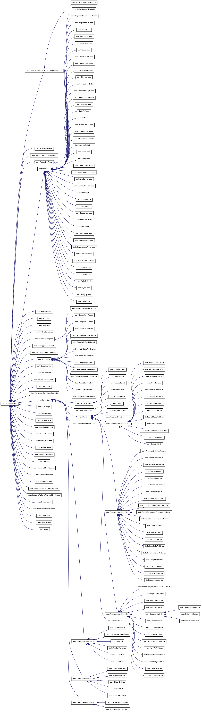

Dart VM Advent Calendar 2012 12/14
###############################################################################

Dart VMのIRに関して
===============================================================================
JVMやLLVMは、中間表現であるBytecodeやBitcodeを入力としていますが、Dart VMの場合、入力はDartのソースコードです。

JITコンパイル時にIRは存在しますが、BytecodeやBitcodeのような用途を目指して、IRは定義されていません。

JITコンパイルする際に、DartのソースコードをASTに変換し、IRに変換し、最終的に実行用のコードを生成します。

その後、JITコンパイルされたコードを実行します。
実行時に生成するオブジェクトが、ObjectとRawObjectになります。

- AST        抽象構文木 (Abstract Syntax Tree)
- IR         中間表現 (Intermediate Representation)
- Object     実行時のオブジェクト、操作や内部状態を定義し、RawObjectを参照する。
- RawObject  実行時のオブジェクト、生データと生データ管理フラグを定義する。

JITコンパイルは、Dartのソースコードを入力としますが、中間成果物であるIRは、実行用のコードを生成した後、
不要になるため捨てます。

ASTは、関数に紐づいてキャッシュされていたかも。

Dart VMのIR
===============================================================================

以下に示すのが、全IRだったきがします。

IRのダンプがみたい場合は、--print-flow-graphを指定すればOKです。

Dart VMのIRは、FlowGraphの各Nodeを構成します。

runtime/vm/intermediate_language.h ::

  // Instructions.
  // M is a single argument macro.  It is applied to each concrete instruction
  // type name.  The concrete instruction classes are the name with Instr
  // concatenated.
  #define FOR_EACH_INSTRUCTION(M)                                                \
    M(GraphEntry)                                                                \
    M(JoinEntry)                                                                 \
    M(TargetEntry)                                                               \
    M(Phi)                                                                       \
    M(Parameter)                                                                 \
    M(ParallelMove)                                                              \
    M(PushArgument)                                                              \
    M(Return)                                                                    \
    M(Throw)                                                                     \
    M(ReThrow)                                                                   \
    M(Goto)                                                                      \
    M(Branch)                                                                    \
    M(AssertAssignable)                                                          \
    M(AssertBoolean)                                                             \
    M(ArgumentDefinitionTest)                                                    \
    M(CurrentContext)                                                            \
    M(StoreContext)                                                              \
    M(ClosureCall)                                                               \
    M(InstanceCall)                                                              \
    M(PolymorphicInstanceCall)                                                   \
    M(StaticCall)                                                                \
    M(LoadLocal)                                                                 \
    M(StoreLocal)                                                                \
    M(StrictCompare)                                                             \
    M(EqualityCompare)                                                           \
    M(RelationalOp)                                                              \
    M(NativeCall)                                                                \
    M(LoadIndexed)                                                               \
    M(StoreIndexed)                                                              \
    M(StoreInstanceField)                                                        \
    M(LoadStaticField)                                                           \
    M(StoreStaticField)                                                          \
    M(BooleanNegate)                                                             \
    M(InstanceOf)                                                                \
    M(CreateArray)                                                               \
    M(CreateClosure)                                                             \
    M(AllocateObject)                                                            \
    M(AllocateObjectWithBoundsCheck)                                             \
    M(LoadField)                                                                 \
    M(StoreVMField)                                                              \
    M(InstantiateTypeArguments)                                                  \
    M(ExtractConstructorTypeArguments)                                           \
    M(ExtractConstructorInstantiator)                                            \
    M(AllocateContext)                                                           \
    M(ChainContext)                                                              \
    M(CloneContext)                                                              \
    M(CatchEntry)                                                                \
    M(BinarySmiOp)                                                               \
    M(UnarySmiOp)                                                                \
    M(CheckStackOverflow)                                                        \
    M(SmiToDouble)                                                               \
    M(DoubleToInteger)                                                           \
    M(CheckClass)                                                                \
    M(CheckSmi)                                                                  \
    M(Constant)                                                                  \
    M(CheckEitherNonSmi)                                                         \
    M(BinaryDoubleOp)                                                            \
    M(MathSqrt)                                                                  \
    M(UnboxDouble)                                                               \
    M(BoxDouble)                                                                 \
    M(UnboxInteger)                                                              \
    M(BoxInteger)                                                                \
    M(BinaryMintOp)                                                              \
    M(ShiftMintOp)                                                               \
    M(UnaryMintOp)                                                               \
    M(CheckArrayBound)                                                           \
    M(Constraint)                                                                \
    M(StringCharCodeAt)                                                          \
    M(StringFromCharCode)

最適化の過程では、各Nodeをさらに高速なNodeに置き換えていきます。

たくさんあるIRですが、種類に応じて分けることができます。

例えば、非最適化時のIR、最適化時のIR、組み込み関数用のIRなどです。

- control     コントロールフローを制御するIR
- common      非最適化、最適化に共通
- optimize    最適化されたIR
- deoptimize  脱最適化用IR
- intrinsic   組み込みIR
- checked     checked mode用IR

試しにちょっと分けてみますか。よくわからないものはcommonにしています。

.. csv-table:: 
  :header: IR, type
  :widths: 20, 20

  GraphEntry, control   
  JoinEntry, control    
  TargetEntry, control  
  Phi, optimize         
  Parameter, common     
  ParallelMove, optimize
  PushArgument, common  
  Return, common        
  Throw, control        
  ReThrow, control      
  Goto, control         
  Branch, control       
  AssertAssignable, checked        
  AssertBoolean, checked           
  ArgumentDefinitionTest, checked  
  CurrentContext, commont
  StoreContext, common
  ClosureCall, common              
  InstanceCall,common              
  PolymorphicInstanceCall, optimie 
  StaticCall, common        
  LoadLocal, common         
  StoreLocal, common        
  StrictCompare, common     
  EqualityCompare, common   
  RelationalOp, common      
  NativeCall, common        
  LoadIndexed, optimize
  StoreIndexed, optimize
  StoreInstanceField, common
  LoadStaticField, common
  StoreStaticField, common
  BooleanNegate, optimize   
  InstanceOf, common        
  CreateArray, common      
  CreateClosure, common     
  AllocateObject, common    
  AllocateObjectWithBoundsCheck, common  
  LoadField, optimize
  StoreVMField, optimize
  InstantiateTypeArguments,common 
  ExtractConstructorTypeArguments, common
  ExtractConstructorInstantiator, common 
  AllocateContext, common   
  ChainContext, common      
  CloneContext, common      
  CatchEntry, control       
  BinarySmiOp, optimize     
  UnarySmiOp, optimize      
  CheckStackOverflow, common
  SmiToDouble, optimize     
  DoubleToInteger, intrinsic
  CheckClass, deoptimize    
  CheckSmi, deoptimize       
  Constant, common          
  CheckEitherNonSmi, deoptimize
  BinaryDoubleOp, optimize
  MathSqrt, intrinsic     
  UnboxDouble, optimize   
  BoxDouble, optimize     
  UnboxInteger, optimize  
  BoxInteger, optimize    
  BinaryMintOp, optimize  
  ShiftMintOp, optimize   
  UnaryMintOp, optimize   
  CheckArrayBound, deoptimize
  Constraint, optmize        
  StringCharCodeAt, intrinsic
  StringFromCharCode, intrinsic

IRの継承関係
===============================================================================

膨大な継承図ですね。。

特徴は、すべてZoneAllocatedクラスを継承していることです。

ZoneAllocatedクラスは、一時的な領域確保用のオブジェクトで、特定のscope(zone)中に生存するオブジェクトです。

特定のzoneの間のみ、例えばコンパイル中のみ生存するIRは、ZoneAllocatedを継承するものが多いです。

特定のzoneを抜けた場合は、ZoneHandleがRAIIに則って、Handleに関連づいた全ZoneAllocatedクラスを一斉開放します。

ZoneAllocatedクラスを継承するクラスは、ASTNodeの子クラスと、Instructionの子クラスが多いですね。

ASTNodeは、dartのソースコードをParseして、ASTの各Nodeになります。

さらに、JITコンパイルが進むと、ASTからIRに変換し、最適化を行った後、
Emitしてアセンブラコードを生成します。

IRはコンパイルが終わったら、一斉に破棄されるはずです。

ASTは何度もコンパイルされる可能性があるため、関数に紐づいてキャッシュされたような気がします。

IRの構成
===============================================================================

.. csv-table::
  :header: src, overview
  :widths: 20, 20

  runtime/vm/intermediate_language.h      , 中間表現の定義
  runtime/vm/intermediate_language.cc     , 中間表現の機種非依存の処理の実装
  runtime/vm/intermediate_language_ia32.cc, 機種依存の命令、アセンブラのEmitと、レジスタ割付のルール

IRには、機種依存を定義する部分があります。

組み込み命令のIRである、DoubleToIntegerInstrを例に説明します。

DoubleToIntegerInstrの機種依存定義部 ::

  // レジスタ割付ルール
  LocationSummary* DoubleToIntegerInstr::MakeLocationSummary() const {
    const intptr_t kNumInputs = 1;  // IRをEmitする際のinputとなるレジスタが1つ必要。
    const intptr_t kNumTemps = 0;   // IRをEmitする間に必要な、tempレジスタ。
    LocationSummary* result =
        new LocationSummary(kNumInputs, kNumTemps, LocationSummary::kCall);
    result->set_in(0, Location::RegisterLocation(ECX)); // inレジスタとして、ECXを予約。
    result->set_out(Location::RegisterLocation(EAX));   // IRをEmit後に生存しているレジスタ。
    return result;                                      // outレジスタとして、EAXを予約。返値格納用。
  }

  // アセンブラのEmitter
  void DoubleToIntegerInstr::EmitNativeCode(FlowGraphCompiler* compiler) {
    Register result = locs()->out().reg();              // outレジスタEAXの別名result
    Register value_obj = locs()->in(0).reg();           // inレジスタECXの別名value_obj
    XmmRegister value_double = XMM0;                    // XMM0レジスタもこっそり使用。
    ASSERT(result == EAX);
    ASSERT(result != value_obj);                        // Unboxingしてdouble値を取得。
    __ movsd(value_double, FieldAddress(value_obj, Double::value_offset())); //BoxingされたDouble型のvalue_objから、double値を取得する。
    __ cvttsd2si(result, value_double);                 // doubleからint32へ変換。XMM0からEAXへ。
    // Overflow is signalled with minint.
    Label do_call, done;
    // Check for overflow and that it fits into Smi.
    __ cmpl(result, Immediate(0xC0000000));             // Smi型に変換した際にoverflowしないかチェック
    __ j(NEGATIVE, &do_call, Assembler::kNearJump);     // overflowする場合、do_call(slowpath)へjump
    __ SmiTag(result);                                  // EAXをSmiTag付けする。 EAX << 1
    __ jmp(&done);                                      // 終了。
    __ Bind(&do_call);                                  // slowpathを定義する。
    __ pushl(value_obj);                                // push ECX
    ASSERT(instance_call()->HasICData());
    const ICData& ic_data = *instance_call()->ic_data();// DoubleToIntegerInstrのICを取得。
    ASSERT((ic_data.NumberOfChecks() == 1));
    const Function& target = Function::ZoneHandle(ic_data.GetTargetAt(0));

    const intptr_t kNumberOfArguments = 1;
    compiler->GenerateStaticCall(instance_call()->deopt_id(),  // StaticCallでDoubleToIntegerのICを呼び出す
                                 instance_call()->token_pos(),
                                 target,
                                 kNumberOfArguments,
                                 Array::Handle(),  // No argument names.,
                                 locs());
    __ Bind(&done);                                     // 終了 return EAX
  }

上記のDoubleToIntegerInstrの処理をざっくり説明すると、

- Double型のオブジェクトをUnboxingする。
- double値からint32値へ変換する。
- int32値がSmi型に収まる場合、Smi型に変換する。
- Smi型に収まらない場合、どんな型でも動作するDoubleToIntegerのInlineCacheを呼び出す。

Emitterは、JITコンパイル時に生成するアセンブラを定義する部分です。

Emitterは、JITコンパイル時にFlowGraphCompilerによって、Emitterが叩かます。

IRからアセンブラに変換する際に必要になります。

まとめ
===============================================================================
(1) IRはJITコンパイルが終われば捨てる。
(2) IRには、機種非依存の定義と機種依存の定義が存在する。
(3) IRの機種非依存部は、レジスタ割付ルールとEmitterを定義する。
