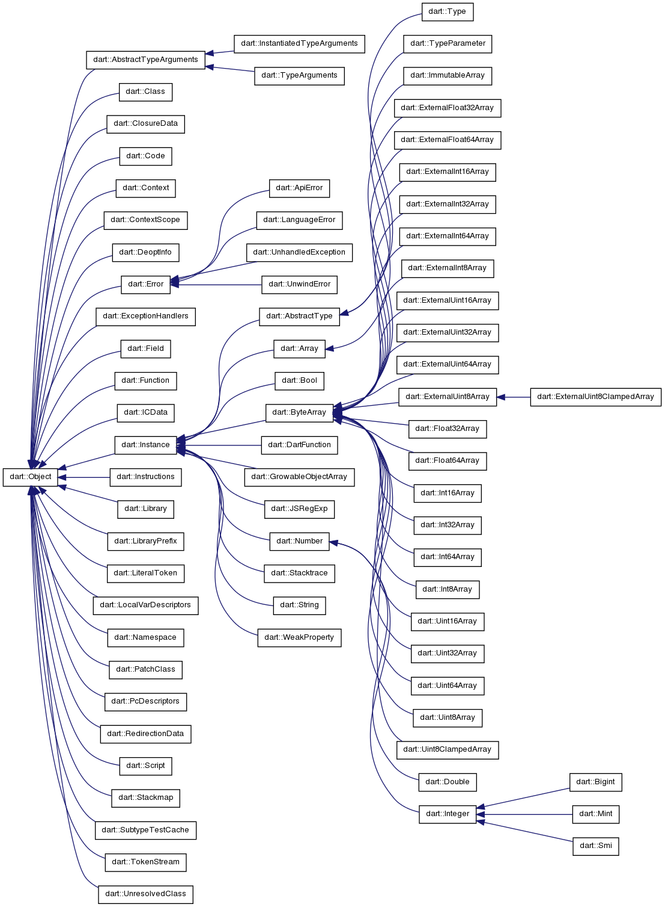
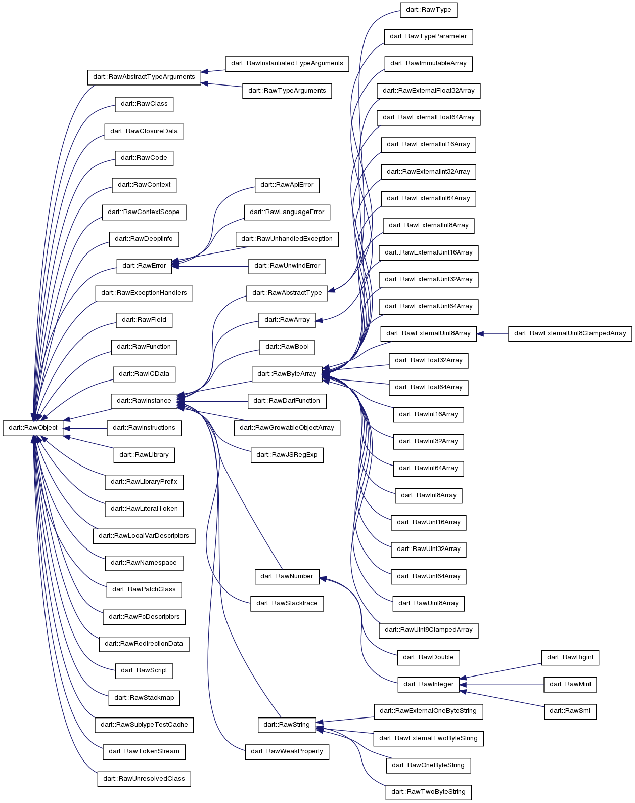

Dart VM Advent Calendar 2012 12/18
###############################################################################

DartのCore API
===============================================================================

Dart SDKのCore APIは、dartだけで記述されていることが少なく、途中からnative extensionを使ってC++実装を呼び出していたり、

Core APIのクラスと対となる、Dart VM内のC++クラスと紐づいていることが多いです。

先々日に紹介したscalarlistパッケージのFloat64Listも、Dart VM内にFloat64Arrayクラスが定義されていました。

今回はStringについて紹介しながら、DartのAPIとDart VM間の階層関係をざっくりとみていきます。

Dartの階層構造
===============================================================================
dartのcore APIであるStringを例に、どのように階層を重ねているのか。

登場するメソッドは、String.concatと、new String()です。

.. blockdiag::

  blockdiag {
    orientation = portrait

    String -> _StringBase -> NATIVE_ENTRY -> "dart::OneByteString"

    "String.concat" -> "_StringBase.concat" -> "NATIVE_ENTRY(String_concat)"
    -> "dart::OneByteString::Concat"

    "new String" -> "_StringBase.createFromCodePoints" -> "NATIVE_ENTRY(StringBase_createFromCodePoints)"
    -> "dart::OneByteString::New" -> "dart::RawOneByteString::raw"
    "dart::RawOneByteString::raw" -> "uint8_t data_[]" [folded]

    "GC ObjectPointVisitor" -> "dart::RawOneByteString::raw" [dir=forward]

    group {
      label="sdk/lib/core/string.dart SDKとして公開される"
      String;
      "String.concat";
      "new String"
    }

    group {
      label="runtime/lib/string_base.dart SDKとして公開されない、Internal"
      _StringBase;
      "_StringBase.concat";
      "_StringBase.createFromCodePoints";
    }

    group {
      label="runtime/lib/string.cc Internalから呼ばれる、Nativeなシンボル群"
      color=lightgreen
      NATIVE_ENTRY;
      "NATIVE_ENTRY(String_concat)";
      "NATIVE_ENTRY(StringBase_createFromCodePoints)";
    }

    group {
      label="runtime/vm/object RUNTIME_ENTRYから操作されるDartVMが管理するオブジェクト(操作用)"
      color=lightblue
      "dart::OneByteString";
      "dart::OneByteString::Concat";
      "dart::OneByteString::New";
    }

    group{
      color=lightblue
      label="runtime/vm/raw_object DartVMが管理するオブジェクト(データ定義)"
      "dart::RawOneByteString::raw";
      "uint8_t data_[]";
    }
  }

DartのAPIの階層は、上記のように階層に分かれます。 ※ ほんとはもっと細かく分かれるかも。。

dartのライブラリ
===============================================================================

Dart SDKのライブラリには、主にsdk/libの下で定義されている、純粋にdartで記述されたライブラリと、
sdk/libから呼ばれる、dartのinternalクラスに分けられます。

dartのinternalクラスは、高速化のためにC++で記述されたメソッド(native extension)を呼び出します。

nativeシンボル
===============================================================================

Dart VMのnative extensionを使用して、Dart VM内部のstatic関数を、DartのCore APIに対して公開しています。

native extensionは、JITコンパイルしたコードを紹介した際に登場したStubsや、CallToRuntimeとは違います。

runtime/libの下で定義されるC++のコードは、DEFINE_NATIVE_ENTRYマクロで定義され、あくまでnative extension機能を使用し、Core APIから呼び出されます。

CallToRuntimeから呼ばれるシンボルは、runtime/vmの下で定義され、DEFINE_RUNTIME_ENTRYマクロで定義されます。

Dart VMのオブジェクト
===============================================================================

Dartのクラスと対応するDart VM内のクラスは、多くの場合 ObectクラスとRawObjectクラスを継承しています。

Objectクラスの継承図と、RawObjectクラスの継承図はそっくりです。

Objectクラスは、主にRawObjectに対する操作のみを定義しています。

RawObjectクラスは、実データを内包し、管理するクラスです。

Objectクラスは、実データを定義するRawObjectクラスへの参照を持ち、必ずペアで定義されています。

そのため、Objectクラスを継承するクラスは、raw_フィールドのみ持ちます。

また、GCのObjectPointerVisitorは、RawObjectを継承したクラスのみを対象とします。

GCとの関連
===============================================================================
GCのVisitorはObjectPointerを辿りながら、GC対象を探します。

その際GCのVisitorは、RawObjectを継承したクラスのみ辿ります。

RawObjectは、最初の1wordがObjctTagが埋まっており、2word以降から実データが定義されています。

上記のRawOneByteStringの場合、実データはuint8_t[]になりますが、実データは辿りません。RawOneByteStringのインスタンスが、ObjectPointerの末端になります。

また、RawOneByteStringであるため、uint8_[]のsizeを格納したlengthフィールドが定義されているはずですが、GCのVisitorに辿らせないような配慮がされています。

RawArrayだった場合には、Arrayとして内包したObjectPointerが多数あるため、GCのVisitorは内包したObjectPointerを辿ります。

まとめ
===============================================================================
(1) Coreのクラスと対となるクラスがDart VM内に定義されている。
(2) Dart VM内には、ObjectとRawObjectが存在する。
(3) GCのVisitorが辿るのはRawObject

